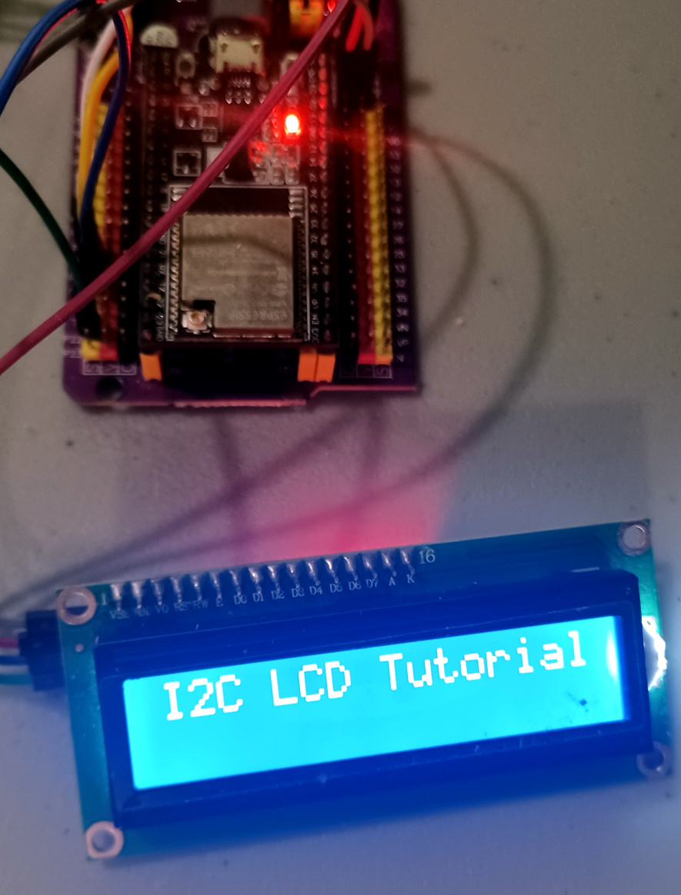

# Demo Project: ESP-32 LCD1602/2004 driver C++ library for the ESP-IDF

## Introduction

This is a demo project for a library to control LCD1602 / LCD 2004  display with 12c using the ESP-32 IDF toolchain [ESP-IDF](https://github.com/espressif/esp-idf).

Please note that this is actually a demo project. The library is in the components folder.



## Features

 * Display numbers
 * Scrolling text
 * Simplified interface
 * C++ Implementation


## Software required

esp-idf v5.3 or later.

# Installation


```Shell
git clone https://github.com/cfrankb/esp32-lcd1602_2004-cpp
cd esp32-lcd1602_2004-cpp/
idf.py set-target {esp32/esp32s2/esp32s3/esp32c3}
idf.py menuconfig
idf.py flash
```

## Suggested wiring for the LCD 1602/2004 12c Display Module

| LCD1602/2004   | wirecolor | GPIO Pin   |
| -------- | --------- | ---------- |
| SDA      | blue      | 21         |
| SCL      | green     | 22         |
| GRN      | black     | GRN        |
| VCC      | red       | 5v *       |

* most models use 5v. There are some variants that operate on 3.3v. Check documentation before proceeding.

## Tested hardware

TBA


## Source Code

The source is available from [GitHub cfrankb/esp32-tm1637plus-cpp](https://github.com/cfrankb/esp32-lcd1602_2004-cpp).


